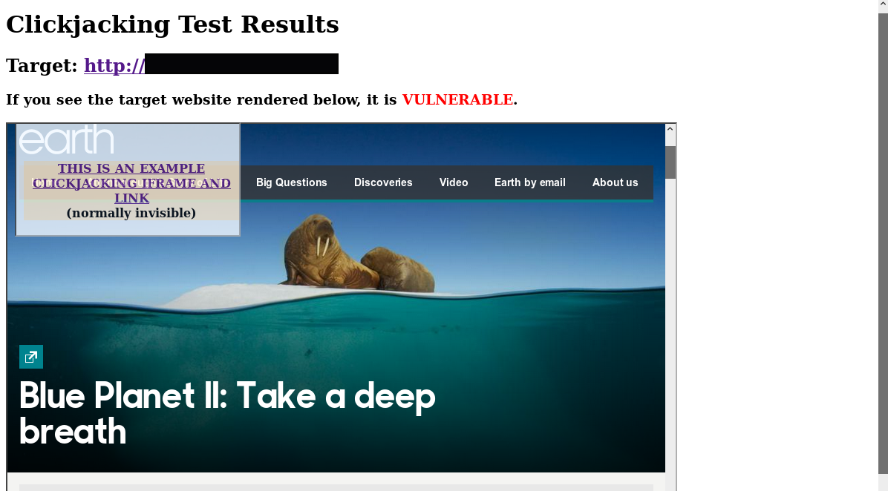
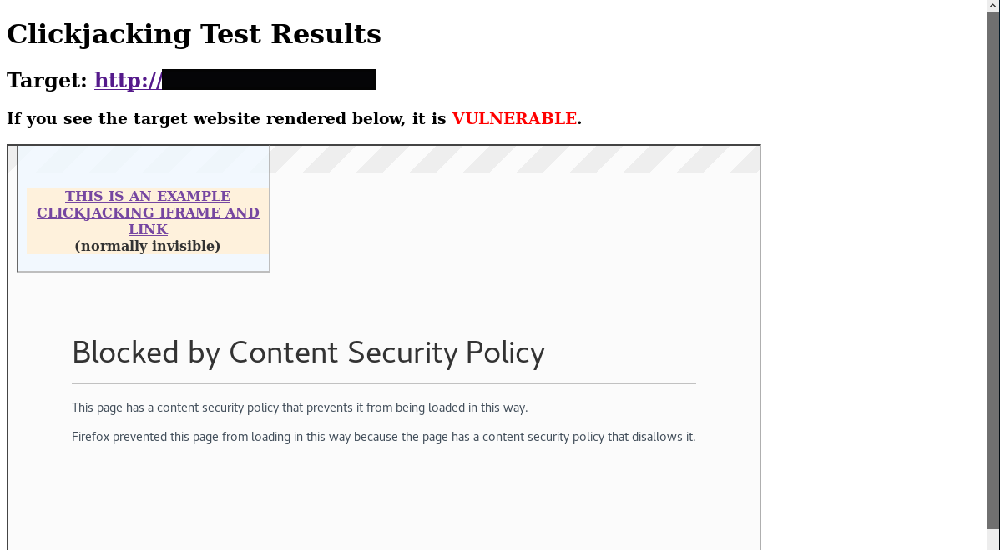

# clickjack
Simple script to test if a page is vulnerable to clickjacking

### Description
Attempts to render the target site in an iframe and places another iframe on top of it as an example attack. Inspired by the PoC html boilerplate provided by OWASP (https://www.owasp.org/index.php/Testing_for_Clickjacking_(OTG-CLIENT-009)#How_to_Test).

### Requirements
python 2.7

### Usage
`python clickjack.py <url>`

### Output
Creates two html pages: 
* cj-target.html - the page that will be automatically opened in your browser
* cj-attacker.html - a page that generates our sample attacking iframe 

### When the page is vulnerable:

### When the page is not vulnerable (may also appear blank):

